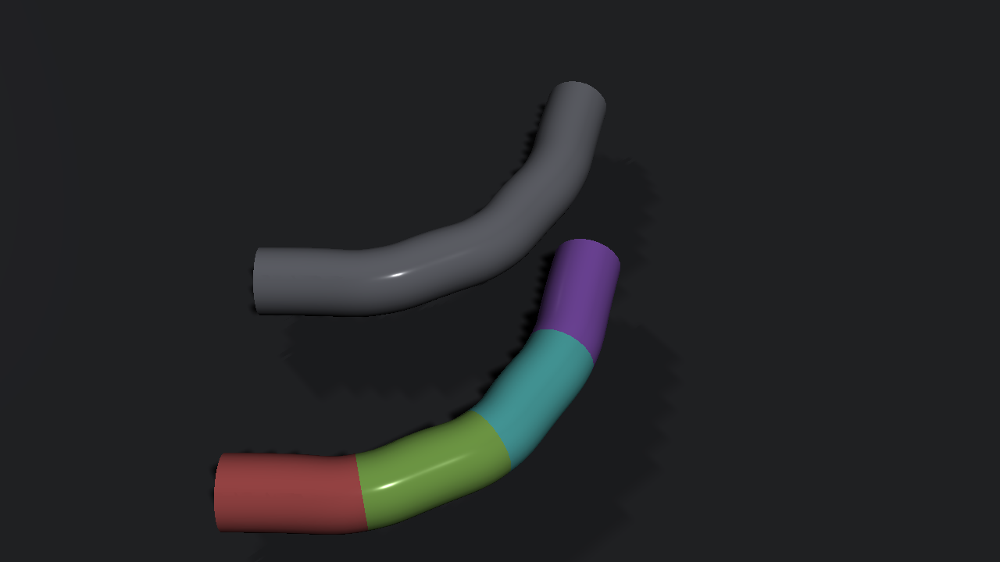
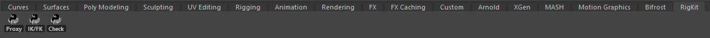

# rig_kit

Four rigging tools for Maya:

- Proxy segmentation: cuts a skinned mesh into one piece per joint and
  constrains the pieces, so animators get a fast playback rig.
- IK/FK matching: snaps and switches two-bone limbs on mGear rigs or any
  other rig. Control names come from a small YAML file.
- Rig validation: checks a rig before publish and writes a JSON or
  Markdown report. Works from the command line too, so it can gate a publish.
- `wheel_01`: an mGear Shifter component for a wheel that rolls on its own
  as the vehicle moves.



The logic is plain Python and is tested without Maya. The `maya_*` modules
are thin: they read the scene, call the core, and write results back.

## Install

Clone or download the repo, then drag `install_rig_kit.py` into the Maya
viewport. It:

- writes `rig_kit.mod` to your `Documents/maya/modules` folder, so Maya adds
  the tool to its Python path on every launch and puts `wheel_01` on
  `MGEAR_SHIFTER_COMPONENT_PATH`;
- installs PyYAML into the repo's `deps` folder with Maya's own pip if Maya
  doesn't have it (stock Maya 2027 doesn't; this needs internet once);
- adds a RigKit shelf with Proxy, IK/FK and Check buttons.

It works in the current session straight away. Drag it in again if you move
the folder. To uninstall, delete `rig_kit.mod` and the RigKit shelf.

At a studio you can put the `.mod` on a shared `MAYA_MODULE_PATH` instead, or
use the Rez package.

## Shelf



| Button | Does |
|---|---|
| Proxy | Builds proxy pieces for the selected skinned mesh(es). |
| IK/FK | Switches every limb that has a selected control. Matches the side you're leaving first, then flips the blend. Works on referenced rigs (`hero:arm_L0_fk1_ctl`). |
| Check | Validates the rig in the scene. Summary in a dialog, full report in the Script Editor. |

IK/FK uses `config/limbs_mgear_biped.yaml` (the default mGear biped). For a
different rig, write your own config and point `RIG_KIT_LIMB_CONFIG` at it.

## Scripting

```python
from rig_kit import maya_segment
pieces = maya_segment.build_proxies("body_geo", smooth_iterations=2, min_faces=20)

from rig_kit import limb_config, maya_ikfk
limbs = limb_config.load("config/limbs_mgear_biped.yaml")
maya_ikfk.switch(limbs["arm_L"], key=True)

from rig_kit import maya_export
maya_export.write_json("D:/tmp/hero_rig.json", maya_export.export_rig())
```

Then outside Maya:

```console
$ rig-kit validate D:/tmp/hero_rig.json --settings config/validation.yaml
# Rig validation: hero_rig

**FAILED** - 2 error(s), 3 warning(s)

| Severity | Rule | Node | Message |
| --- | --- | --- | --- |
| error | control_values | `arm_L0_fk0_ctl` | Not at rest: ry=12.5 |
| error | max_influences | `body_skinCluster` | body_geoShape has vertices with 6 influences (limit 4). |
...
```

The exit code is non-zero when there are errors. You can also tune
segmentation on a mesh dump (`faces`, `weights`, `influences` as JSON):
`rig-kit segment body_dump.json --smooth 2 --min-faces 20`.

## How the pieces work

Segmentation gives each face to the joint with the most summed weight
over its vertices. A few rounds of neighbour voting remove single-face
speckles (a face never moves to a joint with no weight on it). Islands smaller
than `min_faces` merge into the neighbour they share the longest border with,
smallest first, so the result doesn't depend on face order. In Maya all
weights come from one `MFnSkinCluster.getWeights` call, and unowned faces are
deleted with compressed `f[a:b]` ranges.

IK/FK solves the two-bone chain, builds bone frames from the bend plane
and places the pole vector. World rotations are written into each control's
local space, taking the parent, rotate order, `rotateAxis` and `jointOrient`
into account. Euler values stay continuous between keys, and each switch is
one undo chunk.

Validation rules: controls not at rest, channels that should be locked,
deform joints no skin cluster uses, too many influences per vertex, naming
patterns and duplicate short names. Defaults can be overridden from YAML.

`wheel_01` follows the usual Shifter layout (`guide.py` plus a `Component`
in `__init__.py`). Auto roll is a node network, not an expression, so it
scrubs correctly. Place the `root` guide at the wheel centre with Z pointing
the way the vehicle drives, and the `rim` guide on the tyre; the distance
sets the radius.

Limb config example:

```yaml
limbs:
  arm_L:
    blend_attr: armUI_L0_ctl.arm_blend   # 1 = IK, 0 = FK
    chain: [arm_L0_0_jnt, arm_L0_1_jnt, arm_L0_2_jnt]
    fk: [arm_L0_fk0_ctl, arm_L0_fk1_ctl, arm_L0_fk2_ctl]
    ik: arm_L0_ik_ctl
    pole: arm_L0_upv_ctl
    aim_axis: x          # FK axis down the bone ("-x" on the mirrored side)
    up_axis: -z          # FK axis toward the pole
```

## Tests

```console
pip install pytest pyyaml numpy
python -m pytest     # everything that doesn't need Maya
mayapy -m pytest     # also runs the Maya tests (proxies, IK/FK, shelf, installer)
```

The pure tests cover segmentation on synthetic meshes with noisy weights,
IK/FK and Euler round trips for all rotate orders, the validation rules,
reports and CLI, the wheel maths and the Shifter component layout (read with
`ast`, since mGear isn't installed in CI).

## Layout

```
install_rig_kit.py        drop into the viewport to install
config/                  mGear biped limb config, validation settings
examples/                sample rig description for the CLI
python/rig_kit/
    segment.py           face assignment, smoothing, island merging
    ikfk.py, vecmath.py  two-bone solve, frames, Euler conversion
    limb_config.py       YAML limb specs, finding a limb from a control
    validate.py          rules
    report.py            JSON / Markdown reports
    wheel_math.py        wheel roll maths
    cli.py               rig-kit validate / segment
    maya_skin.py         skin weights via API 2.0
    maya_segment.py      proxy builder
    maya_ikfk.py         reading and writing controls
    maya_export.py       rig description from the scene
    maya_shelf.py        shelf button actions
    install.py           module file, PyYAML, shelf
    shifter_components/wheel_01/
    test/
```
